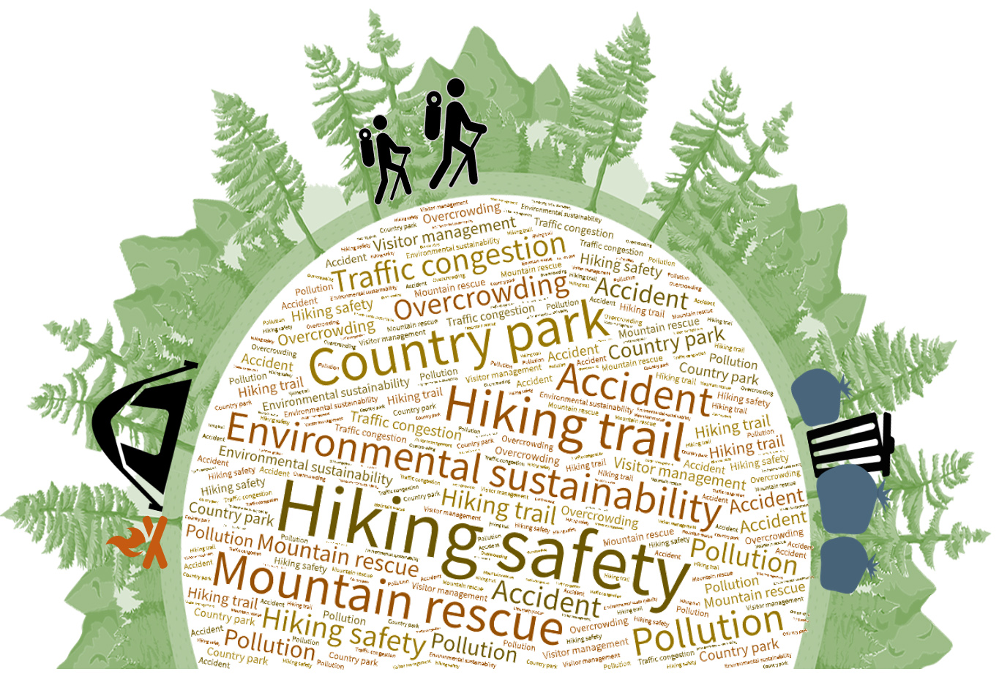
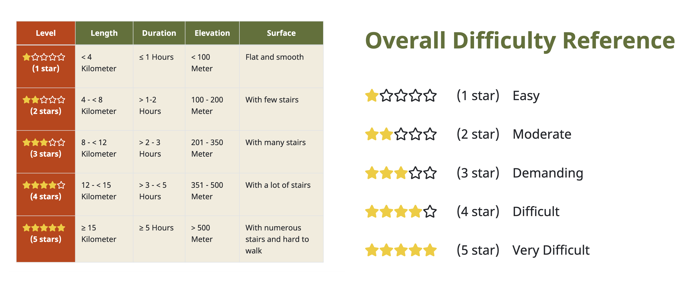

# Introduction
For Hongkongers, hiking is a way of life. According to the findings of the “Territory-wide Physical Fitness Survey for the Community” released previously, hiking was among one of the most popular physical activities for members of the public.

However, some people lack safety awareness, resulting in frequent accidents. In recent years, the number of fatal accidents and injuries related to hiking has risen, and the hiking season is starting again.

# Discover the Hiking Trails in Hong Kong

Hong Kong has a vivid hiking culture. From short nature trails to steep mountains, its Country Parks have something for everyone. These hikes cover Hong Kong Island, Kowloon, New Territories, Sai Kung, and the Outlying Islands. 

## Basic Information for Each Hiking Trail

> template 1 

> **Remarks**: A 5-star system is adopted for assessing the difficulty levels of hiking routes. 5-star represents the most difficult one. The assessment of individual trail conditions, including the “length”, “time required to finish the whole trip”, “gradient” and “surface condition” is tabulated.

---

## The Longest Hiking Trail in Hong Kong
> template 2

---

## The Big Four Trails
> template 3

---

## General Information on Country Parks
> template 4

---

## Distribution of Hiking Trails in Each Park
> template 5

---

# Raising Awareness of Hiking Safety 
Country parks provide hiking trails of various levels of difficulty for public use and enjoyment. Figures from the Fire Services Department (FSD) show that the number of rescue accidents in country parks has been on the rise over the past three years. Due to hiking accidents, some parks pose potential hazards. Hikers can use this information to plan and promote safety.

During the three-year epidemic period, Hong Kong people flocked to country parks for hiking, leading to a sharp increase in the number of rescue incidents.

| Year | Number of Rescue Requests Received | Increase from 2020 |
|------|----------------------------------|--------------------|
| 2020 | 328                              | 0                  |
| 2021 | 588                              | 79%                |
| 2022 | 600                              | 82%                |

*Source: Fire Services Department*

## Overview of the Rescue Accidents in Country Parks
> template 6

---

## Country Parks with the Highest Number of Rescue Requests
> template 7

---

## Country Parks with Highest Number of Injuries and Fatalities
> template 8

---

## Country Parks with the Highest Increase in Accidents in the Past Three Years
> template 9

---

## Accident Black Spots

Statistics show that the Ma On Shan Country Park is the black spot of mountain climbing rescue accidents, with the number of cases and the number of injuries being the highest among the country parks in Hong Kong.

| **Country Park Name** | **Name of location** |
|-----------------------|----------------------|
| Lantau North          | Wong Lung Stream      |
|                       | Nei San Stream (near Nei Lak Shan Country Trail) |
| Lantau North (Extension) | Nei San Stream (also known as Mo Tin Ngai) |
| Lantau South          | Kau Nga Ling area     |
|                       | Shui Lo Cho           |
|                       | Lo Hon Tower          |
|                       | Inverted Wrist Cliff  |
| Lion Rock             | Lion Rock Peak        |
| Ma On Shan            | Tiu Shau Ngam area    |
|                       | The cliff at Fei Ngo Shan (also known as Suicide Cliff) |
| Pat Sin Leng          | The cliff at Hsien Ku Fung (also known as Monkey Cliff) |
|                       | Ping Nam Stream       |
| Plover Cove           | Bride's Pool Waterfall |
| Sai Kung East         | Sharp Peak            |
|                       | Quadruplex Pool       |
|                       | Yin Tsz Ngam          |
|                       | Kim Chu Wan           |
| Sai Kung West         | Mount Hallowes (Tam Chai Shan) |
| Shing Mun             | Tai Shing Stream      |
| Tai Mo Shan           | Tai Shek Stream       |

*Source: https://www.hiking.gov.hk/content/fatal_and_accident_case*